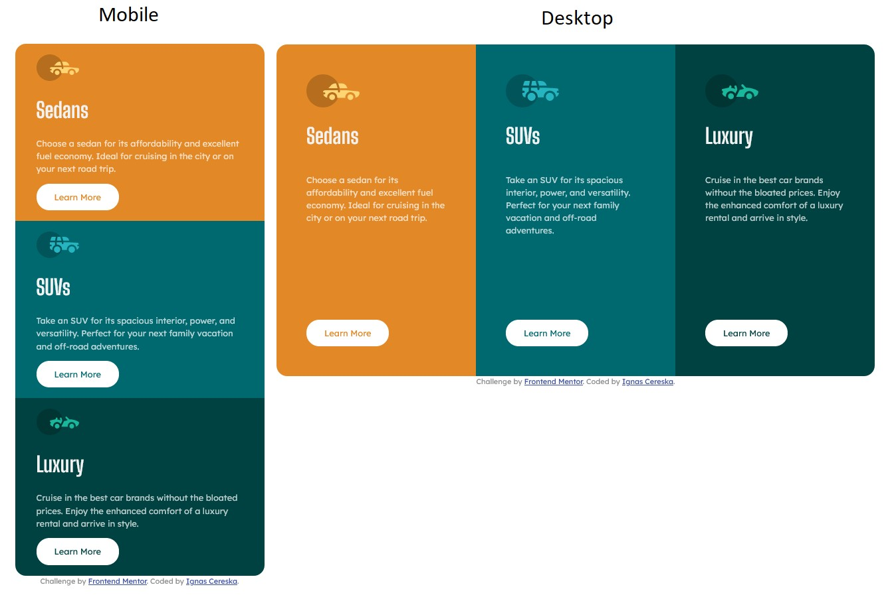

# Frontend Mentor - 3-column preview card component solution

This is a solution to the [3-column preview card component challenge on Frontend Mentor](https://www.frontendmentor.io/challenges/3column-preview-card-component-pH92eAR2-). Frontend Mentor challenges help you improve your coding skills by building realistic projects. 

## Table of contents

- [Overview](#overview)
  - [The challenge](#the-challenge)
  - [Screenshot](#screenshot)
- [My process](#my-process)
  - [Built with](#built-with)
  - [What I learned](#what-i-learned)
  - [Continued development](#continued-development)
  - [Useful resources](#useful-resources)
- [Author](#author)

## Overview

### The challenge

Users should be able to:

- View the optimal layout depending on their device's screen size
- See hover states for interactive elements

### Screenshot



## My process

### Built with

- HTML5 and CSS
- Flex box
- Visual Studio Code software

### What I learned

As I am learning to code, it helps me to visualy see the all the element boundaries, where they are for all those flex boxes, grids etc. And instead of adding a border color to every element, I found "one line to color them all".
```css
html * {
    border: 1px solid red;
}
```
Another great lesson I learned and reinforcing as a good practice: mobile design first as it is much simpler.

### Continued development

Fitting items inside a flex container is still a bit of a struggle.
Centering elements horizontaly and especially vertically is a challenge in certain situations, when I want to keep certain minimum distance from the edge of a window and centered at the same time.

### Useful resources

- (https://www.w3schools.com) - My main goto when I need to remember certain things in html and css.

## Author

- Frontend Mentor - [@ignasc](https://www.frontendmentor.io/profile/ignasc)
- Github - [@ignasc](https://github.com/ignasc)
- Twitter - [@Ignasc](https://twitter.com/Ignasc)
- Instagram - [@ignas.c](https://www.instagram.com/ignas.c/)
